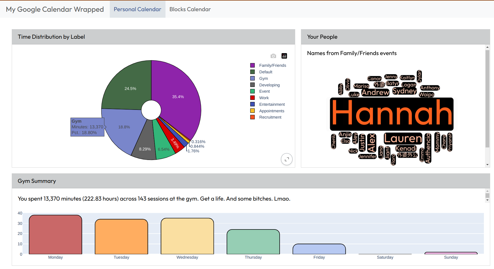

# Google Calendar Wrapped: 2025

A dashboard that summarizes events on my Google calendar. 

I am very meticulous with my Google Calendar - and a benefit of this is that I have a wealth of data to analyze. Using the Google Calendar API, I pulled events from my Personal calendar, and my Blocks calendar. The former is where I put all "personal" events, e.g., time with friends or family, time spent at the gym, etc. I store study or homework sessions (or really any time dedicated to academic activities) in my Blocks calendar. Those are my two main calendars.

The final product is a dashboard (built in Quarto) that provides a visual of how I allocated my time this year. It can be accessed **[here](https://jasminex21.github.io/gcal_wrapped/dashboard.html#)**. Naturally, this isn't perfect, but at the time of writing this README it is currently 3.47am of January 1st, and it feels wrong not to conclude this project. I will consider doing more in-depth and more thorough (inclusion of other calendars) analyses next year.

A final note - the extensive variety of ways people structure their Google Calendar makes it very difficult for me to generalize this project. E.g., some people store all their events in a single calendar, while others split them across many calendars. So, it made more sense for me to just curate this for my own entertainment.

All plots were created using Plotly, with the exception of the word cloud, which was made using [amCharts 5](https://www.amcharts.com/docs/v5/).

